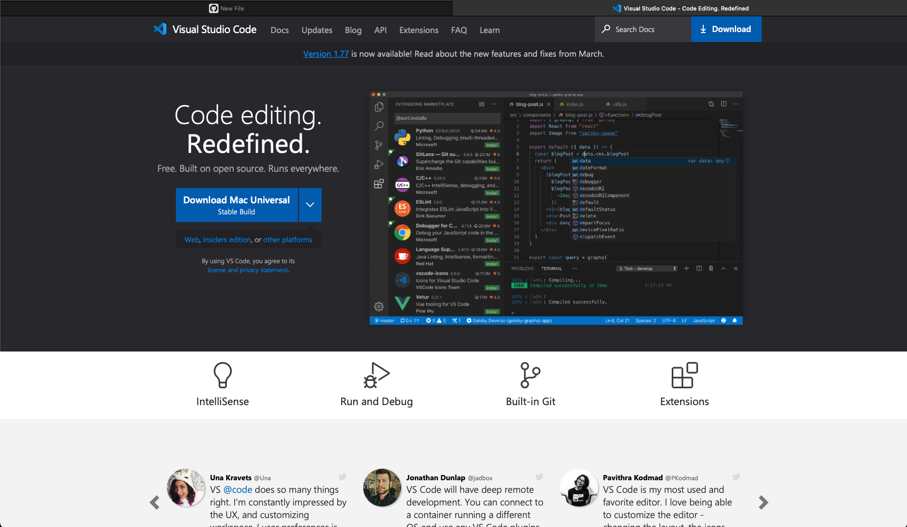
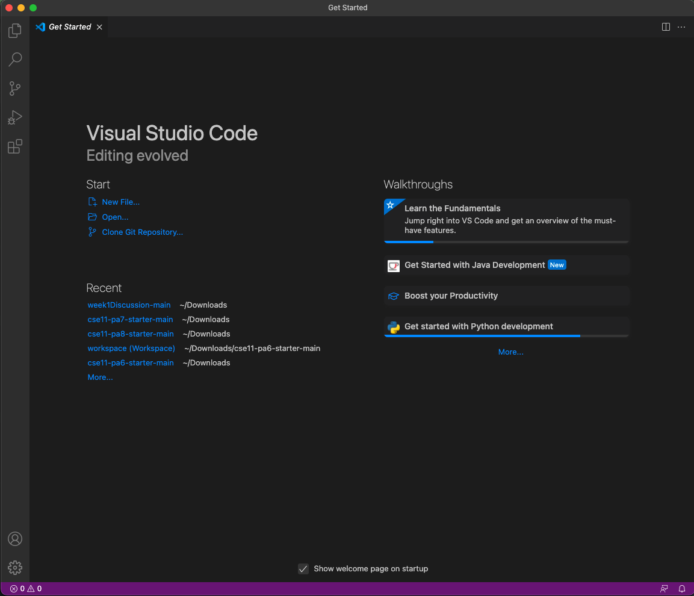
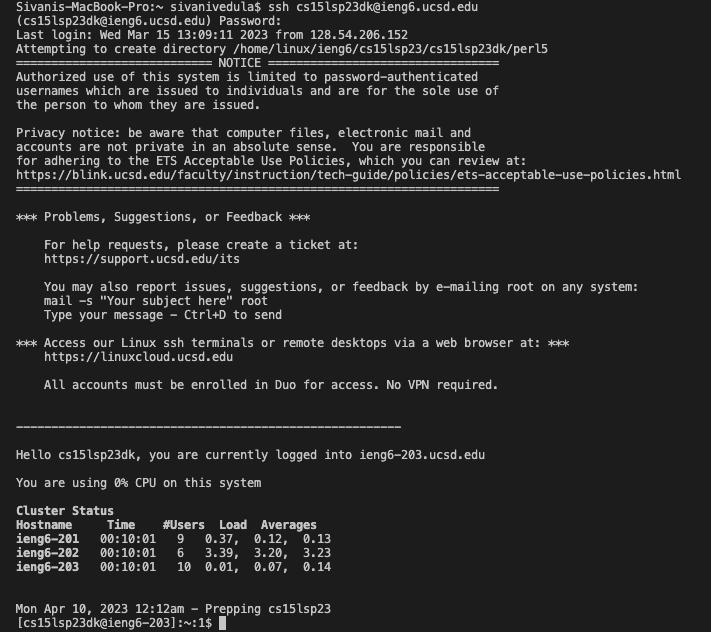
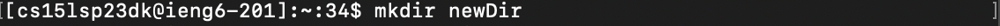
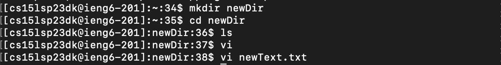
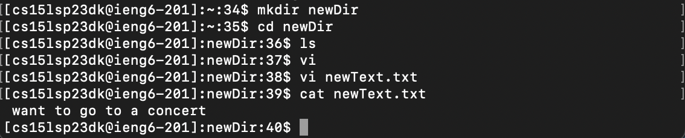
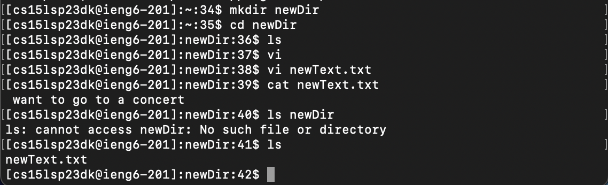
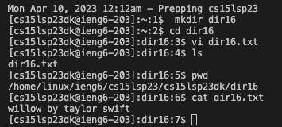

# **Lab Report 1: Remote Access and FileSystem**
*The following report will provide instructions to log into a course-specific account.*

## **STEP 1: Installing VScode**
My computer already has Visual Studio installed, but to start, visit the [Visual Studio Code website](https://code.visualstudio.com/). Download the version of VSCode that matches the operating system your device uses. Follow the instructions given depending on your device.



After opening the application, your screen should look like this. Keep in mind that the appearance (colors, menu bar) may differ based on your device and settings. 



## **STEP 2: Remote Connection**
Now, you can establish the remote connection using terminal on Visual Studio Code. Open a new terminal on VSCode. At the prompt that appears on terminal paste the following command after replacing the "xx" with the two letters at the end of your course specific account username (keep in mind that the "$" dollar sign does should not be included in the command you input):
```
$ ssh cs15lwi23xx@ieng6.ucsd.edu
```
At the prompt, enter the password for your account. At that point, you should see the following screen:



## **STEP 3: Attempting Commands**
At this point, try a few commands! Some popular ones include:

```
$ mkdir // This command stands for "make directory" and allows you to create a new directory.
```



```
$ vi // This commands allows you to create a text file on the screen. To exit the text editor without saving, type :q after pressing Esc. To exit the text editor after saving, type :wq after pressing Esc.
```



```
$ cat // This command means "concatenate" and prints the contents of the file.
```



```
$ cd // This command stands for "change directory" and allows you to move between directories. I am using cd to go into the new directory I made using the mkdir command.
```

```
$ ls // This commands mean "list" and shows all the contents of some directory. As I cd'ed into my new directory newDir where I created my text file using the vi command, ls shows that the contents of newDir consist of that text file. As you can see, after the newText.txt file was created, the ls command showed the presence of the text file in the newDir directory, compared to before its creation when the ls command yielded nothing.
```


These are some other common commands:

```
$ pwd // This command means "print working directory" and prints the path you are currently in.
$ cp // This command means "copy" and lets you copy files or directories to other directories.
```
The following screenshot shows me creating a .txt file in my account's folder and performing some commands on it. 


