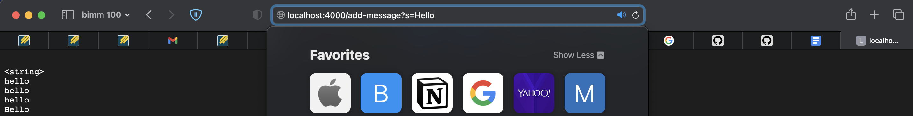
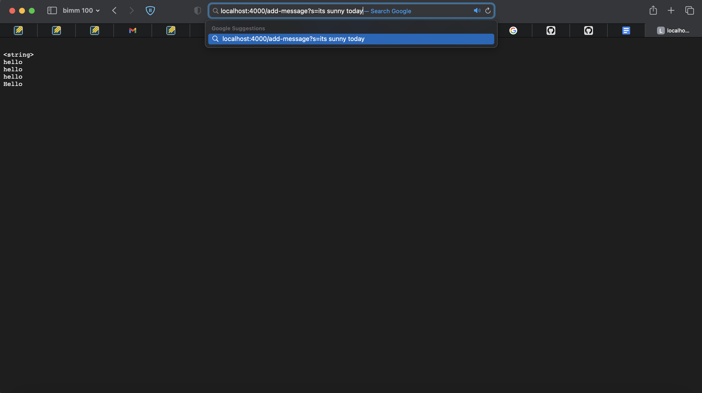
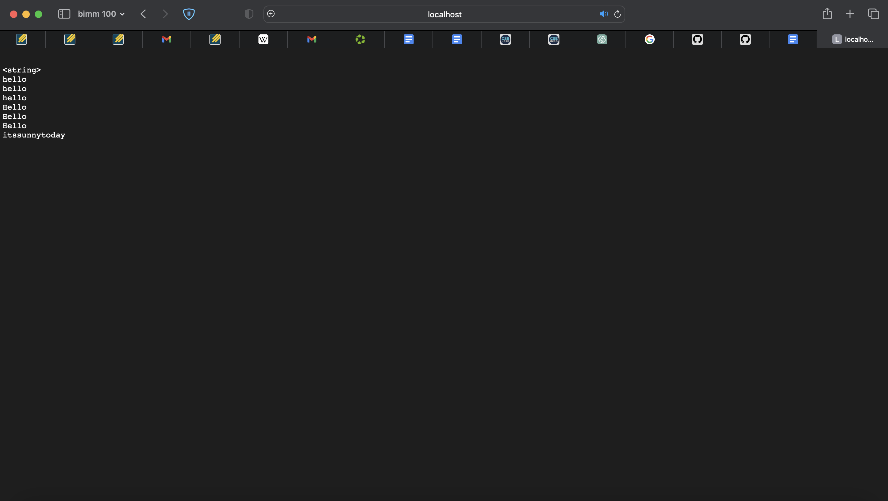
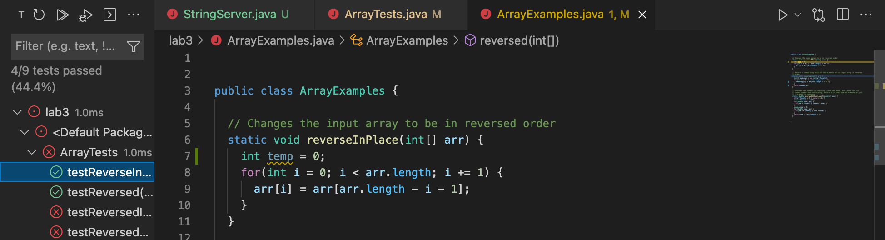
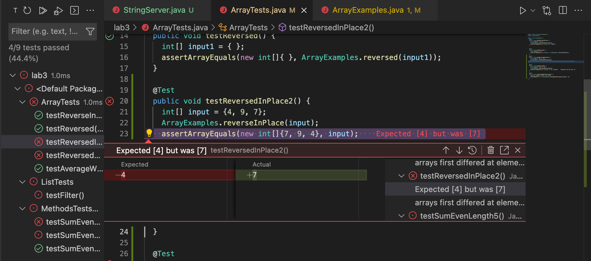
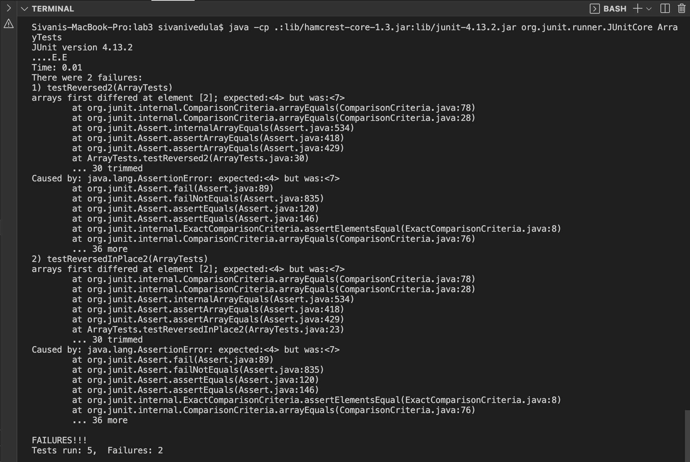

# **Lab Report 2: Servers and Bugs**
*The following report will demonstrate a StringServer and fixing bugs.*

## **STEP 1: StringServer**
```
import java.io.IOException;
import java.net.URI;

class Handler implements URLHandler {
    // The one bit of state on the server: a number that will be manipulated by
    // various requests.
    StringBuilder message = new StringBuilder();

    public String handleRequest(URI url) {
        if (url.getPath().equals("/add-message")) {
            String query = url.getQuery();
            if (query != null && query.startsWith("s=")) {
                String newString = query.substring(2);
                message.append("\n").append(newString);
                return message.toString();
            }
            else {
                return "400 Bad Request: Invalid Query String";
            }
        }
        else {
            return "404 Not Found!";
        } 
    }
}

class StringServer {
    public static void main(String[] args) throws IOException {
        if(args.length == 0){
            System.out.println("Missing port number! Try any number between 1024 to 49151");
            return;
        }

        int port = Integer.parseInt(args[0]);

        Server.start(port, new Handler());
    }
}
```


* This screenshot demonstrates the collective work of the getString(), getQuery(), and toString() method, to isolate the query string to display on the server.
* A relavent argument for using the getPath() method is the path from the URI url object that is the path component of the URL we specify. The getPath() method returns the path component as a String. It is used specifically in this code to check if the path equals "/add-message" at which the rest of the code can proceed, and if not, a"404 Not Found" message will show.
* The getQuery() method retrieves the actual query from the URI object, and the relavent argument for this method is the path from the URI url object. The string it returns is passed to a String query, and the query can be isolated.
* Another set of relavent methods are append and toString(). This screenshot shows an example of the append method which adds a string to the message StringBuilder object.
* A relavent argument for using this method is a string that is set to a String newString object and added to the StringBuilder of words.
* Everytime a new string is added, it will be added to the message object.
* A relavent argument the first time was "<string>" as I had copy pasted from the cse15L website, and that was the first query value that got appended to the message field. At that point, the field consisted of "<string>".


	
* This screenshot shows an example of the append method which adds a string to the message StringBuilder object.
* A relavent argument for using this method is a string that is set to a String newString object and added to the StringBuilder of words.
* Everytime a new string is added, it will be added to the message object.
* Some methods that are called in my code include append, and toString(). A relavent argument after the first time was "hello" at which I refreshed the website 3 times, so "hello" appears there three more times. Those were 3 new query values that got appended to the message field. I then tried adding a string "itssunnyoutside" and you can see me typing it into the search bar. You can then see the aftermath of me typing that query into the search bar at the top in the following picture.
	


## **STEP 2: Fixing Bugs**

**This is the input that does not yield an error in the ArrayTests reversedInPlace program:**
```
@Test 
public void testReverseInPlace() {
   int[] input1 = { 3 };
   ArrayExamples.reverseInPlace(input1);
   assertArrayEquals(new int[]{ 3 }, input1);
}
```
**This is the input that yields an error in the ArrayTests reversedInPlace program:**

```
@Test
public void testReversedInPlace2() {
   int[] input = {4, 9, 7};
   ArrayExamples.reverseInPlace(input);
   assertArrayEquals(new int[]{7, 9, 4}, input);
 }
```
**This is a screenshot of the JUnit tests running and the error they yield, including from the VSCode UI and from terminal:**





**These are the changes between the code before and after the bug fix:**

*Before fix:*

```
public class ArrayExamples {

  // Changes the input array to be in reversed order
  static void reverseInPlace(int[] arr) {
    for(int i = 0; i < arr.length; i += 1) {
      arr[i] = arr[arr.length - i];
    }
  }
}
```

*Functioning code after the fix:*
```
public class ArrayExamples {

  // Changes the input array to be in reversed order
  static void reverseInPlace(int[] arr) {
    int temp = 0;
    for(int i = 0; i < arr.length/2; i += 1) {
      temp = arr[i];
      arr[i] = arr[arr.length - i - 1];
      arr[arr.length - i - 1] = temp;
    }
  }
}
```
This fix worked because changing the arr.length value to arr.length/2 so the loop does not repeat twice. Then, a temp variable was created to contain the arr[i] value and ensure that the right value gets switched and selected.

## **STEP 3: Something New**
Something that was new to me this week was the extensive use of Github, including cloning repositories and using Github desktop. I have always wanted to use Github more to properly keep track of changes in my work and I used it a bit in some basic app dev, but not to this extent where I need to understand where I am doing. I also learned how to fork on Github as well from some master repo. 
