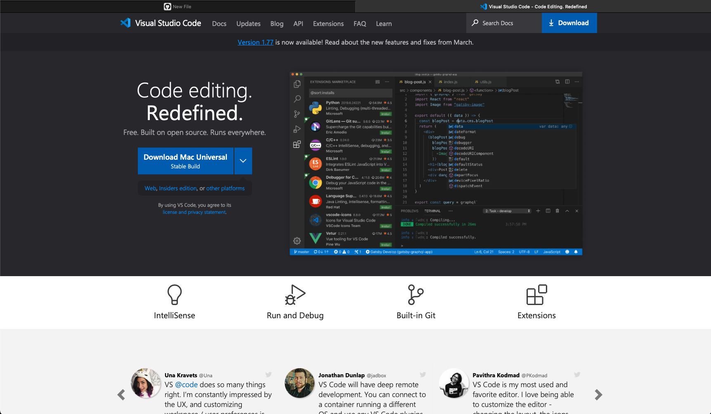

# **Lab Report 1: Remote Access and FileSystem**
*The following report will provide instructions to log into a course-specific account.*

## **STEP 1: Installing VScode**
My computer already has Visual Studio installed, but to start, visit the [Visual Studio Code website](https://code.visualstudio.com/). Download the version of VSCode that matches the operating system your device uses. Follow the instructions given depending on your device.

After opening the application, your screen should look like this. Keep in mind that the appearance (colors, menu bar) may differ based on your device and settings. 
