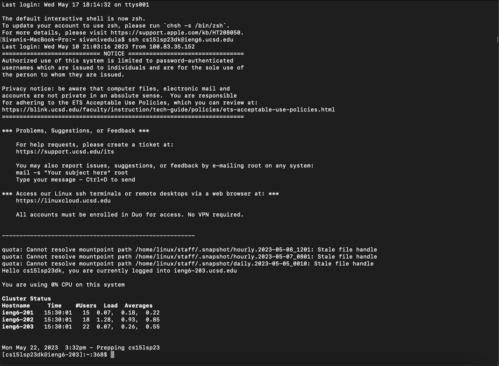
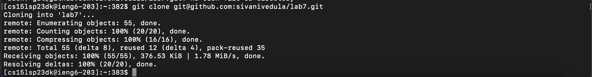
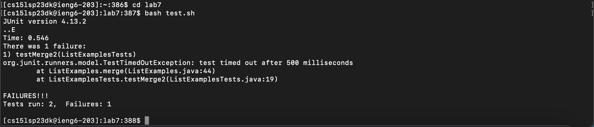
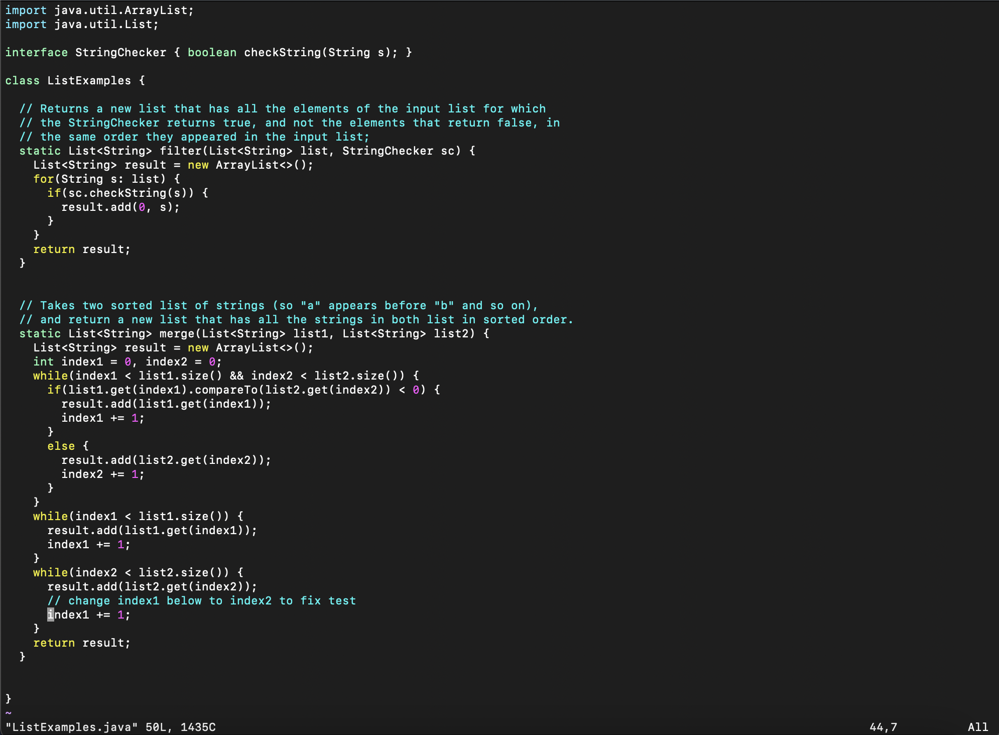
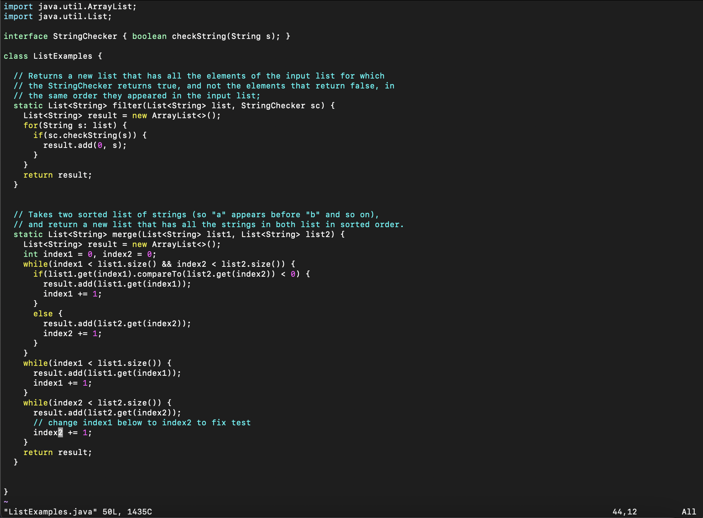
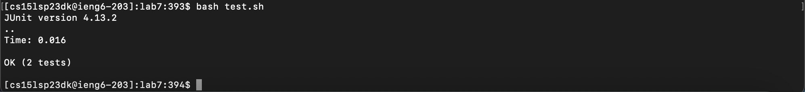
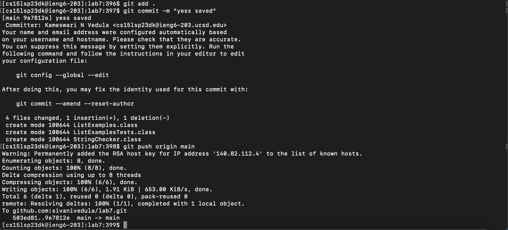

# **Lab Report 4: Speeding Up Command Line Tasks**
*The following report will show what was learned in lab about minimizing efficiency/keypresses with different commands.*

Step 4: Log into ieng6
------
* I logged into ieng6 using the up arrow that cycled through previous commands, and the most recent was the ```ssh cs15lsp23@ieng6.ucsd.edu<enter>```. These commands allowed me to log into the ieng6 account.


Step 5: Clone your fork of the repository from your Github account
------
* I cloned the repository by using the command ```git clone git@github.com:sivanivedula/lab7.git<enter>```, which used the SSH key from github to clone the repository.


Step 6: Run the tests, demonstrating that they fail
------
* I used the command ```cd lab7 <enter>``` to enter the lab7 directory. I then did ```bash t<tab>``` which automatically filled out to ```bash test.sh```. The second command allowed me to run the tests, which as expected, all failed.


Step 7: Edit the code file to fix the failing test
------
* I used the command ```vim L<tab>.java``` which became ```vim ListExamples.java```. This opens the ListExamples.java file in a vim window in terminal to make it editable in terminal itself.

* I used ```g43<enter>``` to go to the 43rd line which included the code that had to be changed.
* I then used ```e<enter>``` to go to the end of the word, which landed the cursor on the "1" of the word index1.
* I then used ```r2<enter>``` to replace the "1" with a "2".
* I think pressed esc, then ```:wq<enter>``` to save and exit the vim window.


Step 8: Run the tests, demonstrating that they now succeed
------
* Back in terminal, I pressed the up arrow twice to get the command ```bash test.sh<enter>``` from my history, and pressed enter to run the command. 


Step 9: Commit and push the resulting change to your Github account 
------
* I used ```git add . <enter>``` to choose all the files available to include in the commit. I then used ```git commit -m "yesss saved"<enter>``` to create a new command. I finally used ```git push origin main``` to push the commit to the repository on Github.


