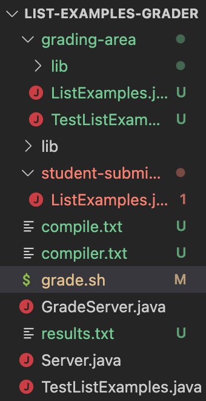

# **Lab Report 5: Debugging + Reflection**

# Part A: Debugging Scenario
*The following report will model a debugging scenario.*

Student Question on EdStem:
------
__What environment are you using (computer, operating system, web browser, terminal/editor, and so on)?__

Using Visual Studio Code on computer

__Detail the symptom you're seeing. Be specific; include both what you're seeing and what you expected to see instead. Screenshots are great, copy-pasted terminal output is also great. Avoid saying “it doesn't work”.__

The GitHub link should prompt the output score of 1/3, which occurs successfully since it should have a compilation error, but the code runs past that and runs the rest of the script giving another score of 2/3.
Terminal output:
```
Sivanis-MacBook-Pro:list-examples-grader sivanivedula$ bash grade.sh https://github.com/ucsd-cse15l-f22/list-methods-compile-error ListExamples.java
Cloning into 'student-submission'...
remote: Enumerating objects: 3, done.
remote: Counting objects: 100% (3/3), done.
remote: Compressing objects: 100% (2/2), done.
remote: Total 3 (delta 0), reused 3 (delta 0), pack-reused 0
Receiving objects: 100% (3/3), done.
Finished cloning
This is the correct file
ListExamples.java:15: error: ';' expected
        result.add(0, s)
                        ^
1 error
You are experiencing a compilation error
You received a 1/3 (33%)
JUnit version 4.13.2
.E
Time: 0.002
There was 1 failure:
1) initializationError(org.junit.runner.JUnitCommandLineParseResult)
java.lang.IllegalArgumentException: Could not find class [TestListExamples]
        at org.junit.runner.JUnitCommandLineParseResult.parseParameters(JUnitCommandLineParseResult.java:100)
        at org.junit.runner.JUnitCommandLineParseResult.parseArgs(JUnitCommandLineParseResult.java:50)
        at org.junit.runner.JUnitCommandLineParseResult.parse(JUnitCommandLineParseResult.java:44)
        at org.junit.runner.JUnitCore.runMain(JUnitCore.java:72)
        at org.junit.runner.JUnitCore.main(JUnitCore.java:36)
Caused by: java.lang.ClassNotFoundException: TestListExamples
        at java.base/jdk.internal.loader.BuiltinClassLoader.loadClass(BuiltinClassLoader.java:641)
        at java.base/jdk.internal.loader.ClassLoaders$AppClassLoader.loadClass(ClassLoaders.java:188)
        at java.base/java.lang.ClassLoader.loadClass(ClassLoader.java:521)
        at java.base/java.lang.Class.forName0(Native Method)
        at java.base/java.lang.Class.forName(Class.java:495)
        at java.base/java.lang.Class.forName(Class.java:474)
        at org.junit.internal.Classes.getClass(Classes.java:42)
        at org.junit.internal.Classes.getClass(Classes.java:27)
        at org.junit.runner.JUnitCommandLineParseResult.parseParameters(JUnitCommandLineParseResult.java:98)
        ... 4 more

FAILURES!!!
Tests run: 1,  Failures: 1

Not all your tests passed correctly completely
You received a 2/3 (67%)
```

__Detail the failure-inducing input and context. That might mean any or all of the command you're running, a test case, command-line arguments, working directory, even the last few commands you ran. Do your best to provide as much context as you can.__

The command line argument is: bash grade.sh https://github.com/ucsd-cse15l-f22/list-methods-compile-error ListExamples.java. I am guessing the error is somewhere around the test running and compilation portion of the script since it runs correctly, but it is just running more than it has to.

The difference is that the GitHub link with all correct codes and tests pass but this link that has a compilation error does not run properly. I am working in list-examples-grader in Visual Studio Code, and in the grade.sh file which is most likely where the error is.

TA Response on EdStem:
------
Looking at your error, it seems there is most likely an issue with the exit code, since code past the compilation is running. Check that you have the right amounts of "exit 1" code in the correct places.

Student Trying:
------

The bug is caused from the code not having proper exit codes and the scipt continues to execute, which is causing the code to run past a certain point despite it failing the requirements. After an "exit 1" in the code following the compilation code where the tests are running and being tested even though they shouldn't be, the output was correct.

Correct Terminal Output:
```
Sivanis-MacBook-Pro:list-examples-grader sivanivedula$ bash grade.sh https://github.com/ucsd-cse15l-f22/list-methods-compile-error ListExamples.java
Cloning into 'student-submission'...
remote: Enumerating objects: 3, done.
remote: Counting objects: 100% (3/3), done.
remote: Compressing objects: 100% (2/2), done.
remote: Total 3 (delta 0), reused 3 (delta 0), pack-reused 0
Receiving objects: 100% (3/3), done.
Finished cloning
This is the correct file
ListExamples.java:15: error: ';' expected
        result.add(0, s)
                        ^
1 error
You are experiencing a compilation error
You received a 1/3 (33%)
```

Setup Information:
----

File/Directory Structure:


Contents of grade.sh (pre-fix):
```
CPATH='.:lib/hamcrest-core-1.3.jar:lib/junit-4.13.2.jar'

set -e

rm -rf student-submission
rm -rf grading-area

mkdir grading-area


git clone $1 student-submission
echo 'Finished cloning'
cp -r lib grading-area

file=$2

if [ -f student-submission/"ListExamples.java" ]; then
    echo "This is the correct file"
else
    echo "This is not the correct file, please submit the correct file"
    echo "you received a 0/3 (0%)"
    exit 1
fi 

cp -f student-submission/"ListExamples.java" "TestListExamples.java" ./grading-area/
cd grading-area

set +e

# javac "student-submission/$file" 
javac -cp .:"$CPATH" *.java

if [ $? -eq 0 ]; then
    echo "the file was correctly compiled"
else 
    echo "You are experiencing a compilation error"
    echo "You received a 1/3 (33%)"
    exit 1
fi

java -cp .:"$CPATH" org.junit.runner.JUnitCore TestListExamples

if [ $? -eq 0 ]; then
    echo "Your tests passed correctly completely"
    echo "You received a 3/3 (100%)"
else
    echo "Not all your tests passed correctly completely"
    echo "You received a 2/3 (67%)"
fi


# Draw a picture/take notes on the directory structure that's set up after
# getting to this point

# Then, add here code to compile and run, and do any post-processing of the
# tests
```

Contents of TestListExamples.java:
```
import static org.junit.Assert.*;
import org.junit.*;
import java.util.Arrays;
import java.util.List;

class IsMoon implements StringChecker {
  public boolean checkString(String s) {
    return s.equalsIgnoreCase("moon");
  }
}

public class TestListExamples {
  @Test(timeout = 500)
  public void testMergeRightEnd() {
    List<String> left = Arrays.asList("a", "b", "c");
    List<String> right = Arrays.asList("a", "d");
    List<String> merged = ListExamples.merge(left, right);
    List<String> expected = Arrays.asList("a", "a", "b", "c", "d");
    assertEquals(expected, merged);
  }
}
```

Contents of ListExamples.java:
```
import java.util.ArrayList;
import java.util.List;

interface StringChecker { boolean checkString(String s); }

class ListExamples {

  // Returns a new list that has all the elements of the input list for which
  // the StringChecker returns true, and not the elements that return false, in
  // the same order they appeared in the input list;
  static List<String> filter(List<String> list, StringChecker sc) {
    List<String> result = new ArrayList<>();
    for(String s: list) {
      if(sc.checkString(s)) {
        result.add(0, s)
      }
    }
    return result;
  }


  // Takes two sorted list of strings (so "a" appears before "b" and so on),
  // and return a new list that has all the strings in both list in sorted order.
  static List<String> merge(List<String> list1, List<String> list2) {
    List<String> result = new ArrayList<>();
    int index1 = 0, index2 = 0;
    while(index1 < list1.size() && index2 < list2.size()) {
      if(list1.get(index1).compareTo(list2.get(index2)) < 0) {
        result.add(list1.get(index1));
        index1 += 1;
      }
      else {
        result.add(list2.get(index2));
        index2 += 1;
      }
    }
    while(index1 < list1.size()) {
      result.add(list1.get(index1));
      index1 += 1;
    }
    while(index2 < list2.size()) {
      result.add(list2.get(index2));
      index1 += 1;
    }
    return result;
  }


}
```

Command line to trigger the bug:
```
bash grade.sh https://github.com/ucsd-cse15l-f22/list-methods-compile-error ListExamples.java
```

Description of what to edit to fix the bug:
Add "exit" after "echo "You received a 3/3 (100%)"" in grade.sh code to exit the code before the point so the tests aren't run since the file didn't even compile correctly.

# Part B: Reflection
Before the second half of this quarter, I did not how to run a server or how to really write a bash script, so it's really cool that I know how to now because I can recognize how useful it is to run repeated commands on several files.
